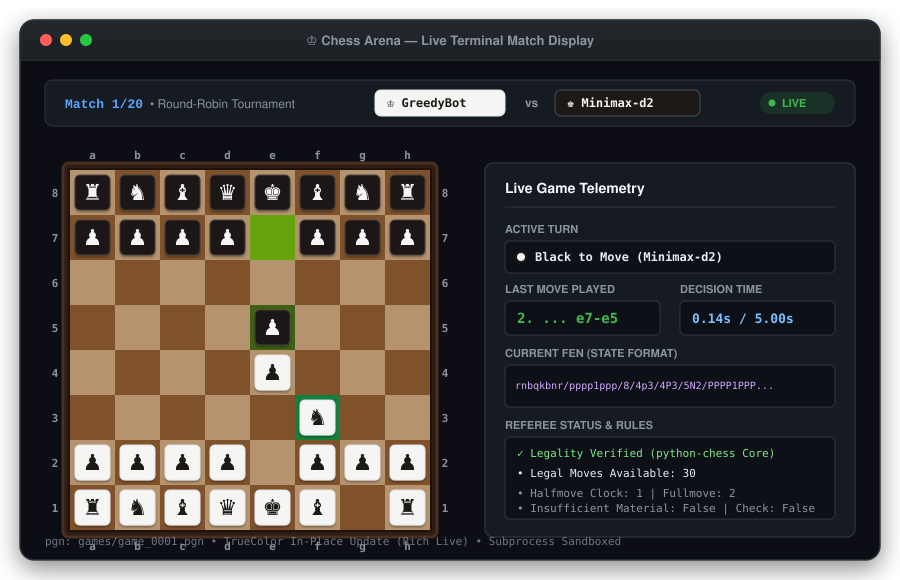
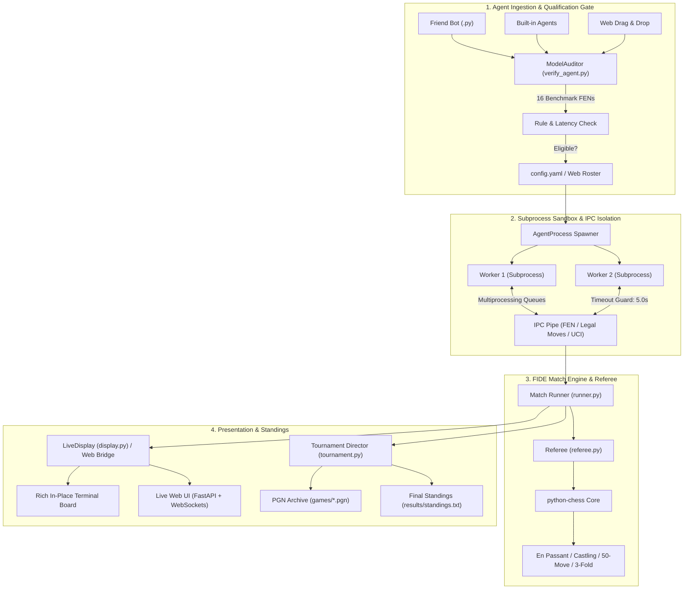

<div align="center">

# ♔ `Chess Arena`
### A Production-Grade Multi-Agent Competition Framework & Model Eligibility Gate

**Host real-time AI chess tournaments in a live browser UI, audit custom models across 16 FIDE edge benchmarks, and referee agent matches in isolated sandboxes.**

[](tests/)
[-brightgreen.svg)](chess_arena/tests/)
[](#-live-web-ui--5-bot-uploader)
[](#-why-chess-arena)
[](#-model-eligibility--qualification-gate-verify_agentpy)
[](#-system-architecture)
[](https://python.org)
[](#-terminal-match-visualization)
[](LICENSE)

<p align="center">
  <a href="#-quick-demo"><b>⚡ Quick Demo</b></a> •
  <a href="#-live-web-ui--5-bot-tournament-hosting"><b>🌐 Live Web UI</b></a> •
  <a href="#-how-to-build-a-tournament-compliant-bot"><b>🤖 Build a Bot</b></a> •
  <a href="#-community-ai-prompt-check-bot-compliance-with-chess-arena-environment"><b>💬 AI Compliance Audit Prompt</b></a> •
  <a href="#-why-chess-arena"><b>💡 Why Chess Arena</b></a> •
  <a href="#-model-eligibility--qualification-gate-verify_agentpy"><b>🛡️ Model Eligibility Gate</b></a> •
  <a href="#-benchmark-positions--compliance-matrix"><b>📊 Benchmark Suite</b></a> •
  <a href="#-system-architecture"><b>📐 Architecture</b></a> •
  <a href="#-quick-start"><b>🚀 Quick Start</b></a>
</p>

<br>

<p align="center">
  
</p>

</div>

---

## ⚡ Quick Demo

### 1. Host Live Tournaments in the Web UI *(Recommended)*

The primary and recommended way to run tournaments is through the **Live Web UI**. It provides drag-and-drop bot uploading (up to 5 bots), real-time move animations over WebSockets, live telemetry, and an automated leaderboard:

```bash
# Launch the live web server
$ python main.py --web

# Or use the standalone launcher:
$ python web_server.py --port 8000
```
Open **`http://127.0.0.1:8000`** in your browser. Click **"🤖 Manage Bots"** to drop in custom agent files, select your roster, and click **"▶ Start Tournament"** to watch the pieces battle in real time!

---

### 2. Auditing an External / Friend Model for Tournament Eligibility

Audit any custom model (e.g. from `sample_friend_bot.py` or module spec) across **16 critical FIDE positions**, benchmark its decision latency, and verify subprocess IPC isolation:

```bash
$ python verify_agent.py sample_friend_bot.py
```

```text
╔═════════════════════════════════════════════════════════════════════════════╗
║                                                                             ║
║   🛡️ MODEL ELIGIBILITY & COMPLIANCE AUDIT                                   ║
║   ══════════════════════════════════════════════════════════════════        ║
║    Model Candidate : Auditor-Test-Agent (TacticalRaiderBot)                 ║
║    Source Location : sample_friend_bot.py                                   ║
║    Qualification   : ELIGIBLE FOR TOURNAMENT                                ║
║    Score           : 93/100  (20/20 checks passed)                          ║
║                                                                             ║
╚═════════════════════════════════════════════════════════════════════════════╝
┌────────────────────── Move Latency & Resource Profile ──────────────────────┐
│                                                                             │
│   Benchmark Metric             Measurement      Threshold   Status          │
│  ──────────────────────────────────────────────────────────────────         │
│   Average Move Latency              0.2 ms              —     ✅            │
│   95th Percentile Latency           0.4 ms      < 4000 ms     ✅            │
│   Peak Decision Time                0.4 ms      < 5000 ms     ✅            │
│   Tested Benchmark Positions            14   16 positions     ✅            │
│                                                                             │
└─────────────────────────────────────────────────────────────────────────────┘

✅ 0 Deficiencies Found: Agent is 100% compliant with FIDE & Framework rules!

┌────────────────────────── Roster Enrolment Ready ───────────────────────────┐
│ To admit this model into the competition roster: Add this entry to          │
│ config.yaml:                                                                │
│                                                                             │
│   - name: "Auditor-Test-Agent"                                              │
│     module: "sample_friend_bot.py"                                          │
│     class: "TacticalRaiderBot"                                              │
│     config: {}                                                              │
│                                                                             │
└─────────────────────────────────────────────────────────────────────────────┘
```

---

### 3. Terminal Match Visualization *(Headless / CLI)*

For terminal-only environments or remote SSH sessions, watch tournament games execute in real time on a dedicated in-place live chessboard without terminal flickering:

```bash
$ python main.py --display --delay 0.1
```

```text
  Match 1/20: [GreedyBot] vs [Minimax-d2]  (Round-Robin)

    a   b   c   d   e   f   g   h
  +---+---+---+---+---+---+---+---+
8 | r | n | b | q | k | b | n | r | 8
  +---+---+---+---+---+---+---+---+
7 | p | p | p | p | . | p | p | p | 7
  +---+---+---+---+---+---+---+---+
6 | . | . | . | . | . | . | . | . | 6
  +---+---+---+---+---+---+---+---+
5 | . | . | . | . | p | . | . | . | 5
  +---+---+---+---+---+---+---+---+
4 | . | . | . | . | P | . | . | . | 4
  +---+---+---+---+---+---+---+---+
3 | . | . | . | . | . | N | . | . | 3
  +---+---+---+---+---+---+---+---+
2 | P | P | P | P | . | P | P | P | 2
  +---+---+---+---+---+---+---+---+
1 | R | N | B | Q | K | B | . | R | 1
  +---+---+---+---+---+---+---+---+
    a   b   c   d   e   f   g   h

  Turn: Black (Minimax-d2)  |  Move 2: e7e5  |  Clock: 0.14s / 5.00s
  White: P, N, B, R, Q, K   |  Black: p, n, b, q, k, r
```

---

## 🌐 Live Web UI & 5-Bot Tournament Hosting

The **Chess Arena Web UI** is the centerpiece of the framework, offering an interactive competition dashboard that mirrors the macOS TrueColor terminal aesthetic.

### Launching the Web Server

```bash
# Recommended command:
python main.py --web

# Or specify a custom port:
python web_server.py --port 8080
```
Then navigate to **`http://127.0.0.1:8000`** in any web browser.

### Key Web UI Features:
1. **Interactive 8×8 Wooden Chessboard**:
   - High-contrast piece tiles (`#1c1917 on #f5f5f4` for White, `#f5f5f4 on #1c1917` for Black) that stay crisp on every square.
   - Dynamic move origin (`#65a30d`) and destination (`#3f6212`) highlights.
   - Pulsing red check alert indicator (`#ef4444`) on King squares under attack.
   - Captured piece graveyard tracking material balance for both sides.
2. **Real-Time WebSocket Streaming (`/ws/live`)**:
   - Zero-lag move updates with live decision stopwatch (`0.14s / 5.00s`).
   - One-click copyable FEN state string.
   - Live referee status: Legal move counter, 50-move rule clock, and check status.
   - Scrollable historical move log with timestamps.
3. **5-Bot Uploader & Instant Eligibility Gate**:
   - Click **"🤖 Manage Bots"** to open the drag-and-drop modal.
   - Drop up to 5 custom Python bot files (`.py`) into the drop zone.
   - Automatically executes the 16-FEN qualification audit in the background.
   - Instant scorecard displaying eligibility verdict, score, latency, and fix guidelines.
   - Checkbox roster selector allowing you to pick any 2 to 5 bots for the upcoming bracket.
4. **Live Playback Controls & Leaderboard**:
   - Start, Pause, Resume, and Stop controls.
   - Interactive speed slider (from ultra-fast `0.05s` up to `1.50s` per move).
   - Format switcher (Round-Robin vs Single Elimination).
   - Dynamic tournament standings table updating points, wins, draws, losses, and win rate.
   - One-click PGN match download button.
   - Procedural wooden move click audio feedback (with mute toggle).

---

## 🤖 How to Build a Tournament-Compliant Bot

Any model (heuristic engine, Minimax search, RL policy, MCTS, or LLM-based player) can compete in Chess Arena as long as it adheres to the lightweight `ChessAgent` contract.

### 1. The Bot Contract

Create a Python file (e.g. `my_agent.py`) and inherit from `ChessAgent`:

```python
from chess_arena.arena.adapter import ChessAgent
import chess

class MyChessBot(ChessAgent):
    def __init__(self, name: str = "MyChessBot", config: dict | None = None) -> None:
        """Initialize hyperparameters, load model weights, or set search depth."""
        super().__init__(name=name, config=config or {})

    def get_move(self, fen: str, legal_moves: list[str]) -> str:
        """Choose and return one legal UCI move.

        Parameters
        ----------
        fen : str
            The board position in Forsyth–Edwards Notation.
        legal_moves : list[str]
            Every strictly legal move available (e.g. ['e2e4', 'g1f3', ...]).

        Returns
        -------
        str
            A valid move in UCI format (e.g. 'e2e4', 'e7e8q').
        """
        # Your custom logic here (search, heuristics, neural net, etc.)
        return legal_moves[0]
```

### 2. Requirements to Pass the 16-FEN Qualification Audit

To receive an `ELIGIBLE FOR TOURNAMENT` verdict from the auditor, your bot must satisfy these 6 rules:

| Rule | Requirement | What Fails the Audit |
| :--- | :--- | :--- |
| **1. Strict Legality** | Pick a move exclusively from `legal_moves`. | Returning illegal moves, moving pinned pieces, or advancing into check. |
| **2. UCI Move Format** | Format move strings as 4–5 character UCI (`e2e4`, `g1f3`). | Returning SAN (`Nf3`), descriptive notation (`P-K4`), or non-string objects. |
| **3. Pawn Promotions** | When promoting, always append the promotion piece letter (`e7e8q`, `e7e8r`, `e7e8b`, `e7e8n`). | Returning 4 characters on promotion (`e7e8`), which is ambiguous in chess rules. |
| **4. Check Responses** | When under check, play a legal king evasion, block, or capture. | Ignoring checks or attempting impossible moves. |
| **5. Latency Budget** | Decide each move within the time limit (< 5.00s, ideally < 100ms). | Infinite loops, deep unpruned searches, or slow network calls. |
| **6. Subprocess Safety** | Run cleanly in isolated child processes without side-effects. | Calling `sys.exit()`, raising unhandled exceptions, or hanging IPC pipes. |

### 3. Pre-Test Before Uploading

Before uploading your bot to the web interface or tournament roster, run the standalone validator CLI:

```bash
python verify_agent.py path/to/my_agent.py
```

If it prints `ELIGIBLE FOR TOURNAMENT`, your bot is 100% ready to compete!

---

## 💬 Community AI Prompt: Check Bot Compliance with Chess Arena Environment

Before uploading your or your friend's chess bot to **Chess Arena**, you can use **ChatGPT, Claude, Gemini, or Cursor** to audit, debug, and check whether your existing bot code is 100% compliant with our competition environment.

Copy and paste the prompt below into your AI along with your bot's Python code:

<details open>
<summary><b>📋 Click to copy the Community AI Environment Compliance Checker Prompt</b></summary>

```text
Act as the Official Chess Arena Environment Compliance Auditor and Referee.
DO NOT WRITE A NEW BOT FROM SCRATCH. Your objective is to thoroughly AUDIT, TEST, and VERIFY whether my attached Python chess bot code is 100% compliant with the "Chess Arena" competition platform and will pass the automated 16-FEN benchmark qualification gate (verify_agent.py) without crashes, illegal moves, timeouts, or disqualifications.

================================================================================
CHESS ARENA ENVIRONMENT SPECIFICATIONS & CONSTRAINTS:
================================================================================
1. RUNTIME EXECUTION ENVIRONMENT:
   - Python 3.10+ runtime.
   - The tournament runner executes bot moves inside isolated worker subprocesses (AgentProcess) using IPC pipes.
   - HARD MOVE TIMEOUT: Exactly 5.00 seconds per move. If an agent does not return a move before the timeout, it forfeits the game by timeout. Recommended average decision time is < 50ms.
   - The referee validates all moves using python-chess: `chess.Move.from_uci(move) in board.legal_moves`.

2. MANDATORY CLASS CONTRACT & INTERFACE:
   - Must import: `from chess_arena.arena.adapter import ChessAgent`
   - Must inherit from `ChessAgent`.
   - Constructor signature must be:
     `def __init__(self, name: str = "...", config: dict | None = None) -> None:`
     and MUST call `super().__init__(name=name, config=config or {})`.
   - Primary move decision method MUST be:
     `def get_move(self, fen: str, legal_moves: list[str]) -> str:`
     * Note: `fen` is the current board state in Forsyth–Edwards Notation.
     * Note: `legal_moves` is a list of all strictly legal UCI move strings (e.g. ['e2e4', 'g1f3', 'e7e8q']).

3. MOVE FORMAT & FIDE LEGALITY RULES:
   - RETURN TYPE: Must return a single `str` object. Returning `None`, integers, tuples, or `chess.Move` objects will crash the referee.
   - NOTATION: Must be lowercase UCI (Universal Chess Interface) format (e.g. 'e2e4', 'g1f3', 'e7e8q'). NEVER return Standard Algebraic Notation / SAN (e.g. 'Nf3', 'O-O', 'Qxd4+') or descriptive notation.
   - STRICT LEGALITY: The returned string MUST exist in the provided `legal_moves` list under ALL circumstances.
   - PAWN PROMOTIONS: Any pawn reaching the back rank MUST include the 5th promotion piece character in lowercase (e.g. 'e7e8q', 'e7e8r', 'e7e8b', 'e7e8n'). Returning 4 characters (e.g. 'e7e8') will be rejected as an illegal move and cause immediate forfeiture.
   - CHECK DEFENSE: When under check, the bot must only return a legal king evasion, blocking move, or attacker capture.
   - ABSOLUTE PINS: The bot must never attempt to move a pinned piece in any direction that exposes its King to check.
   - CASTLING & EN PASSANT: Must respect castling rights ('e1g1', 'e1c1', 'e8g8', 'e8c8') and valid en passant capture squares.

4. SUBPROCESS SAFETY & RESILIENCE:
   - FORBIDDEN CALLS: Never call `sys.exit()`, `os._exit()`, `quit()`, or attempt to terminate the interpreter.
   - NO BLOCKING I/O: No calls to `input()`, `sleep()` exceeding budget, network sockets, or excessive disk I/O.
   - FAIL-SAFE FALLBACK: The entire evaluation or search logic must be protected with a broad `try...except` block. If ANY unexpected exception, recursion error, or calculation failure occurs, it must safely fall back:
     `if legal_moves: return legal_moves[0]`

================================================================================
AUDIT INSTRUCTIONS & REQUIRED OUTPUT FORMAT:
================================================================================
Perform a strict static code analysis of the attached bot and provide your response in the following 4 sections:

### 1. ENVIRONMENT COMPLIANCE SCORECARD
Evaluate each item as [PASS], [WARNING], or [FAIL]:
- [ ] Module Import & Subclass (`from chess_arena.arena.adapter import ChessAgent`)
- [ ] Constructor Signature & `super().__init__` Call
- [ ] Method Signature (`get_move(self, fen: str, legal_moves: list[str]) -> str`)
- [ ] Return Value Type & UCI Format (lowercase string, no SAN)
- [ ] Pawn Promotion Compliance (5-character syntax, e.g. 'e7e8q')
- [ ] Move Legality & Inclusion in `legal_moves`
- [ ] Subprocess Isolation & Exception Safety (try/except fallback present)
- [ ] Latency Budget Safety (search depth bounded, no infinite loops)

### 2. QUALIFICATION VERDICT
State clearly:
- **STATUS**: [ELIGIBLE FOR TOURNAMENT] or [NON-COMPLIANT / DISQUALIFIED]
- **COMPLIANCE SCORE**: __ / 100

### 3. DEFICIENCIES & ENVIRONMENT RISKS FOUND
List any and all syntax errors, API contract deviations, illegal move hazards, promotion flaws, or unhandled exceptions that could cause the bot to fail `verify_agent.py` or be disqualified by the live referee. If none, confirm that the code is clean.

### 4. CERTIFIED COMPLIANT CODE
If any deficiencies were identified, provide the full, corrected, and certified Python code with all fixes applied, preserving the original strategic intent while ensuring 100% environment compliance.

---
[ATTACH YOUR BOT PYTHON CODE HERE]
```

</details>

---

## 💡 Why Chess Arena?

When evaluating Reinforcement Learning models, LLM agents, or heuristic search engines in competitive chess, naive execution scripts fail in production:
1. **Rule Violations & False Claims**: Models generate pseudo-legal moves (e.g., castling through check, invalid en passant, advancing pinned pieces). Without a strict FIDE referee, invalid moves corrupt evaluations.
2. **Infinite Loops & Memory Leaks**: An unisolated agent crashing, allocating infinite RAM, or hanging indefinitely freezes the entire tournament suite.
3. **Friend & Community Submissions**: When peers or collaborators submit weights or Python models, manual testing is tedious and prone to runtime disqualifications midway through a 100-game tournament.

**`Chess Arena` provides a bulletproof competition environment with strict sandboxing and an automated eligibility qualification gate.**

| Dimension | Naive Tournament Scripts | Chess Arena Framework |
| :--- | :--- | :--- |
| **Live Web Hosting** | None / console text only | **Full Web UI** with WebSocket streaming, speed slider, and 5-bot uploader |
| **Move Validation** | Basic piece movement checks | **Strict FIDE Referee** (En Passant, 3-fold repetition, 50-move rule, check evasion, castling rights) |
| **Process Isolation** | In-process execution (one crash halts tournament) | **Subprocess IPC Pipe Isolation** with hard per-move timeouts (`AgentProcess`) |
| **Model Eligibility Gate** | None (crashes mid-tournament) | **Automated 16-FEN Rule & Latency Auditor** (`verify_agent.py`) |
| **Live Visualization** | Scrolling terminal spam / prints new board every move | **Live TrueColor Web UI & In-Place Terminal TUI** with anti-contrast wooden board theme |
| **Tournament Formats** | Hardcoded 1v1 loop | **Round-Robin** & **Single-Elimination** brackets with PGN export & tie-breaks |
| **Agent Interface** | Custom, divergent APIs | Standardized `ChessAgent` with plug-and-play `.py` support |

---

## 🛡️ Model Eligibility & Qualification Gate (`verify_agent.py`)

Got a model from a friend, student, or teammate? Don't run it blindly in a tournament! Use the **Model Eligibility Gate** to verify rule compliance, move legality, execution safety, and decision latency.

### How to Upload & Audit a Model

#### Step 1: Place the Model File
Have your friend provide their Python agent file, or drop it into `uploaded_agents/`:
```bash
uploaded_agents/
└── friend_bot.py      # Your friend's custom agent
```
*(You can also test with the included sample: [`sample_friend_bot.py`](sample_friend_bot.py))*

#### Step 2: Run the Auditor
Run the auditor via the Web UI (drag & drop) or using the CLI:

```bash
# Option A: In the Web UI
Open http://127.0.0.1:8000 -> Click "Manage Bots" -> Drag & drop your bot!

# Option B: Direct CLI file audit
python verify_agent.py sample_friend_bot.py

# Option C: Integration via main CLI
python main.py --verify-agent sample_friend_bot.py

# Option D: Interactive picker (automatically scans uploaded_agents/)
python verify_agent.py
```

#### Step 3: Qualification Criteria
The Auditor evaluates the candidate model against strict tournament standards:

1. **Interface Contract**: Inherits from `ChessAgent` and implements `get_move(fen: str, legal_moves: list[str]) -> str`.
2. **Move Legality**: Returns strictly legal UCI moves across 16 benchmark edge positions.
3. **Safety & Resilience**: Catches internal crashes, unhandled exceptions, and memory overruns.
4. **Latency Budget**: Measures average latency, 95th-percentile latency, and peak decision time against the tournament threshold (default: 5.0s).
5. **IPC Subprocess Isolation**: Verifies that the model spawns and communicates over standard multiprocessing pipes without deadlocking.

#### Step 4: Admitting to Tournament Roster
If the model passes, the auditor generates the exact YAML snippet to copy into `config.yaml`:
```yaml
agents:
  - name: "Friend-Alpha-Zero"
    module: "sample_friend_bot.py"
    class: "TacticalRaiderBot"
    config:
      temperature: 0.2
```

---

## 📊 Benchmark Positions & Compliance Matrix

The auditor subjects candidate models to 16 canonical edge-case positions from FIDE tournament practice:

| # | Benchmark Position | FEN Test Vector | Evaluated Rule / Mechanic |
| :-: | :--- | :--- | :--- |
| **1** | **Standard Startpos** | `rnbqkbnr/pppppppp/8/8/8/8/PPPPPPPP/RNBQKBNR w KQkq - 0 1` | 20 legal opening moves (16 pawn pushes + 4 knight hops) |
| **2** | **Under Check** | `rnb1kbnr/pppp1ppp/8/4p3/5PPq/8/PPPPP2P/RNBQKBNR w KQkq - 1 3` | Mandatory king evasion or blocking (Fool's Mate defense) |
| **3** | **En Passant Capture** | `rnbqkbnr/ppp1p1pp/8/3pPp2/8/8/PPPP1PPP/RNBQKBNR w KQkq f6 0 3` | En passant pawn capture legality (`e5f6`) |
| **4** | **Kingside Castling** | `r1bqk2r/pppp1ppp/2n2n2/2b1p3/2B1P3/5N2/PPPP1PPP/RNBQK2R w KQkq - 4 4` | Kingside castling execution (`e1g1`) |
| **5** | **Queenside Castling** | `r3kbnr/ppp1pppp/2nq4/3p4/3P4/2NQ4/PPP1PPPP/R3KBNR w KQkq - 2 5` | Queenside castling execution (`e1c1`) |
| **6** | **Castling Through Check** | `r3k2r/ppp2ppp/2n5/3q4/3b4/5N2/PPPP1PPP/R3K2R w KQkq - 0 1` | Rejection of castling across attacked transit squares |
| **7** | **Pawn Promotion** | `8/4P3/8/8/8/8/k7/4K3 w - - 0 1` | Mandatory promotion move syntax (`e7e8q`, `e7e8r`, etc.) |
| **8** | **Absolute Pin** | `rnb1k1nr/pp1p1ppp/4p3/8/1b1NP3/2N5/PPP2PPP/R1BQKB1R w KQkq - 1 6` | Pinned piece (c3 knight) restricted from exposing King |
| **9** | **Double Check** | `r1bk3r/ppp2ppp/8/4N3/1b2n3/2N5/PPPB1PPP/R3K2R w KQ - 0 10` | King must move; blocking or capturing double checkers impossible |
| **10** | **Discovered Check** | `rnbqk2r/pppp1ppp/4pn2/8/1bPP4/2N5/PP2PPPP/R1BQKBNR w KQkq - 2 4` | Response to discovered line attacks |
| **11** | **Knight Fork Tactic** | `r1bqkb1r/pppp1ppp/2n5/4p3/4n3/3P1N2/PPP2PPP/RNBQKB1R w KQkq - 0 5` | Tactical threat recognition & evasion |
| **12** | **Back-Rank Mate Threat** | `6k1/5ppp/8/8/8/8/8/4R1K1 w - - 0 1` | Execution of forced back-rank checkmate (`e1e8#`) |
| **13** | **Stalemate Avoidance** | `k7/8/1K6/8/8/8/8/1R6 w - - 0 1` | Avoidance of accidental stalemate traps |
| **14** | **Insufficient Material** | `8/8/5k2/8/8/5K2/8/4B3 w - - 0 1` | Recognition of automatic FIDE draw condition (K+B vs K) |
| **15** | **Endgame Pawn Race** | `8/p7/8/8/8/8/P7/k6K w - - 0 1` | Passed pawn conversion in queenless endgames |
| **16** | **Underpromotion** | `8/PPP4k/8/8/8/8/8/7K w - - 0 1` | Valid underpromotion to Knight/Bishop/Rook |

---

## 📐 System Architecture

`Chess Arena` decouples agent logic, tournament scheduling, rule validation, and visual rendering into modular subsystems:



---

## 🤖 Agent Roster & Baselines

`Chess Arena` includes a diverse suite of baseline agents ready for competition:

| Agent | Module | Description | Strategy |
| :--- | :--- | :--- | :--- |
| **`RandomAgent`** | `chess_arena.agents.random_agent` | Uniform random move selector | Baseline control; tests referee against chaos. |
| **`GreedyAgent`** | `chess_arena.agents.greedy_agent` | Material capture maximizer | Evaluates move captures with standard piece values (Q=9, R=5, B=3, N=3, P=1). |
| **`CenterControlAgent`** | `chess_arena.agents.center_control_agent` | Positional heuristic agent | Prioritizes controlling central squares (`d4`, `d5`, `e4`, `e5`) and piece development. |
| **`MinimaxAgent`** | `chess_arena.agents.minimax_agent` | Depth-limited tree search | 2-3 ply Minimax with Alpha-Beta pruning, piece-square positional tables, and king safety. |
| **`HumanAgent`** | `chess_arena.agents.human_agent` | Interactive CLI player | Allows humans to test and play directly against AI models from the terminal. |
| **`TacticalRaiderBot`** | `sample_friend_bot.py` | Community template bot | Demonstrates promotions, tactical checks, MVV-LVA captures, and center control. |

---

## 🚀 Quick Start

### 1. Installation

```bash
# Clone the repository
git clone https://github.com/FreakyAdy/chessy.git
cd chessy

# Install dependencies
pip install -r requirements.txt
```

### 2. Launch the Web UI *(Recommended)*

```bash
python main.py --web
```
Open **`http://127.0.0.1:8000`** in your browser. Upload bots or pick built-in agents, configure match speed, and watch tournaments live!

### 3. Verify Your Environment

Run the full referee, web server, and model auditor test suite (49 unit tests):

```bash
python -m unittest discover -s chess_arena/tests
```

### 4. Audit a Friend's Model via CLI

```bash
python verify_agent.py sample_friend_bot.py
```

### 5. Run a Headless / Terminal Tournament

```bash
# Run in background with summary output
python main.py

# Run with LIVE in-place animated terminal chessboard
python main.py --display --delay 0.15 --pause 2.5
```

---

## ⚙️ Configuration Guide (`config.yaml`)

Configure tournament brackets, time limits, display settings, and the agent roster in `config.yaml`:

```yaml
tournament:
  format: "round_robin"         # Options: "round_robin" or "single_elimination"
  games_per_pair: 2             # Number of games between each pair (swapping colors)

match:
  move_time_limit: 5.0          # Hard timeout in seconds per move (forfeits on timeout)
  max_moves: 500                # Draw limit to prevent infinite loops
  display_board: true           # Enable live in-place board rendering
  move_delay: 0.15              # Sleep time (s) between moves for smooth animation
  game_pause: 2.5               # Freeze time (s) after a game concludes

output:
  games_dir: "games"            # Directory where PGN match logs are saved
  results_dir: "results"        # Directory where final standings are recorded

agents:
  - name: "RandomBot"
    module: "chess_arena.agents.random_agent"
    class: "RandomAgent"
    config: {}

  - name: "GreedyBot"
    module: "chess_arena.agents.greedy_agent"
    class: "GreedyAgent"
    config: {}

  - name: "CenterControlBot"
    module: "chess_arena.agents.center_control_agent"
    class: "CenterControlAgent"
    config: {}

  - name: "Minimax-d2"
    module: "chess_arena.agents.minimax_agent"
    class: "MinimaxAgent"
    config:
      depth: 2

  # Custom community model admitted via ModelAuditor:
  - name: "TacticalRaider"
    module: "sample_friend_bot.py"
    class: "TacticalRaiderBot"
    config: {}
```

---

## 📁 Repository Structure

```text
chessy/
├── chess_arena/
│   ├── arena/
│   │   ├── adapter.py          # ChessAgent base class & AgentProcess IPC wrapper
│   │   ├── board.py            # Board representation & TrueColor anti-contrast rendering
│   │   ├── display.py          # Live in-place Rich terminal board visualizer
│   │   ├── referee.py          # Strict FIDE move validator & game-end adjudicator
│   │   ├── runner.py           # Game coordinator & per-game visualizer lifecycle
│   │   ├── tournament.py       # Round-robin / single-elimination scheduler
│   │   └── validator.py        # ModelAuditor qualification engine (16 benchmark FENs)
│   ├── agents/
│   │   ├── random_agent.py     # Random baseline
│   │   ├── greedy_agent.py     # Material greedy baseline
│   │   ├── center_control_agent.py # Positional center-control baseline
│   │   ├── minimax_agent.py    # Minimax depth-limited search with alpha-beta
│   │   └── human_agent.py      # Interactive human CLI player
│   ├── web/
│   │   ├── app.py              # FastAPI REST endpoints & WebSocket server
│   │   ├── tournament_bridge.py# Async tournament coordinator & event streamer
│   │   └── static/
│   │       ├── index.html      # SVG-matching semantic UI layout
│   │       ├── styles.css      # TrueColor wooden board palette & glassmorphism
│   │       └── app.js          # Live board renderer, WS client & bot uploader
│   └── tests/
│       ├── test_edge_cases.py  # Forced mates, pins, repetition tests
│       ├── test_referee.py     # FIDE rule compliance tests
│       ├── test_runner.py      # Match orchestration & PGN generation tests
│       ├── test_validator.py   # ModelAuditor eligibility gate tests
│       └── test_web.py         # FastAPI REST & WebSocket streaming tests
├── uploaded_agents/            # Directory where uploaded community bots are saved
├── sample_friend_bot.py        # Complete, tested custom friend bot ready for upload
├── games/                      # Automatically archived PGN records
├── results/                    # Final tournament standings output
├── verify_agent.py             # Standalone Model Eligibility Gate CLI
├── web_server.py               # Standalone Web UI server launcher
├── main.py                     # Primary tournament CLI & server entry point
├── config.yaml                 # Active tournament configuration
└── requirements.txt            # Python dependencies
```

---

## 🤝 Contributing & Community Agents

Contributions are welcome! Whether you are submitting a new heuristic agent, an RL policy adapter, or additional referee test vectors:

1. Build your bot using the [AI Prompt](#-community-ai-prompt-generate-a-bot-in-seconds) or copy [`sample_friend_bot.py`](sample_friend_bot.py).
2. Test it locally: `python verify_agent.py <your_file>.py`.
3. Open a Pull Request with your verified agent and test coverage.

---

## 📄 License

Distributed under the **[MIT License](LICENSE)**.
