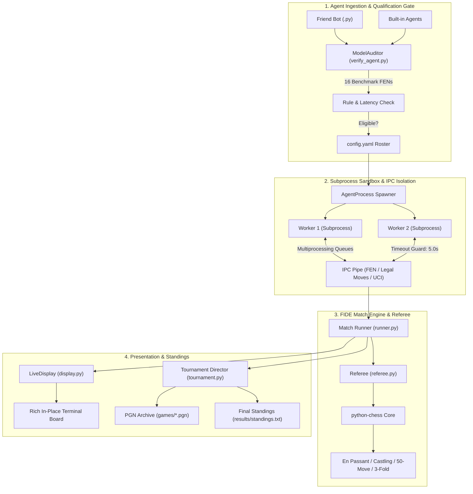

<div align="center">

# ♔ `Chess Arena`
### A Production-Grade Multi-Agent Competition Framework & Model Eligibility Gate

**Audit, benchmark, and referee candidate chess AI agents before entering the tournament arena.**

[](tests/)
[-brightgreen.svg)](chess_arena/tests/)
[](#-live-web-ui--5-bot-uploader)
[](#-why-chess-arena)
[](#-model-eligibility--qualification-gate-verify_agentpy)
[](#-system-architecture)
[](https://python.org)
[](#-live-terminal-visualizer)
[](LICENSE)

<p align="center">
  <a href="#-quick-demo"><b>⚡ Quick Demo</b></a> •
  <a href="#-live-web-ui--5-bot-uploader"><b>🌐 Live Web UI</b></a> •
  <a href="#-why-chess-arena"><b>💡 Why Chess Arena</b></a> •
  <a href="#-model-eligibility--qualification-gate-verify_agentpy"><b>🛡️ Model Eligibility Gate</b></a> •
  <a href="#-benchmark-positions--compliance-matrix"><b>📊 Benchmark Suite</b></a> •
  <a href="#-system-architecture"><b>📐 Architecture</b></a> •
  <a href="#-agent-roster--baselines"><b>🤖 Agent Roster</b></a> •
  <a href="#-quick-start"><b>🚀 Quick Start</b></a>
</p>

<br>

<p align="center">
  
</p>

</div>

---

## ⚡ Quick Demo

### 1. Auditing an External / Friend Model for Tournament Eligibility

Audit any custom model (e.g. from `uploaded_agents/friend_bot.py` or module spec) across **16 critical FIDE positions**, benchmark its decision latency, and verify subprocess IPC isolation:

```bash
$ python verify_agent.py uploaded_agents/template_agent.py
```

```text
╔═════════════════════════════════════════════════════════════════════════════╗
║                                                                             ║
║   🛡️ MODEL ELIGIBILITY & COMPLIANCE AUDIT                                   ║
║   ══════════════════════════════════════════════════════════════════        ║
║    Model Candidate : Auditor-Test-Agent (CommunityFriendAgent)              ║
║    Source Location : uploaded_agents/template_agent.py                      ║
║    Qualification   : ELIGIBLE FOR TOURNAMENT                                ║
║    Score           : 93/100  (20/20 checks passed)                          ║
║                                                                             ║
╚═════════════════════════════════════════════════════════════════════════════╝
┌────────────────────── Move Latency & Resource Profile ──────────────────────┐
│                                                                             │
│   Benchmark Metric             Measurement      Threshold   Status          │
│  ──────────────────────────────────────────────────────────────────         │
│   Average Move Latency              0.1 ms              —     ✅            │
│   95th Percentile Latency           0.1 ms      < 4000 ms     ✅            │
│   Peak Decision Time                0.1 ms      < 5000 ms     ✅            │
│   Tested Benchmark Positions            14   16 positions     ✅            │
│                                                                             │
└─────────────────────────────────────────────────────────────────────────────┘

✅ 0 Deficiencies Found: Agent is 100% compliant with FIDE & Framework rules!

┌────────────────────────── Roster Enrolment Ready ───────────────────────────┐
│ To admit this model into the competition roster: Add this entry to          │
│ config.yaml:                                                                │
│                                                                             │
│   - name: "Auditor-Test-Agent"                                              │
│     module: "uploaded_agents/template_agent.py"                             │
│     class: "CommunityFriendAgent"                                           │
│     config: {}                                                              │
│                                                                             │
└─────────────────────────────────────────────────────────────────────────────┘
```

---

### 2. Live Web UI & 5-Bot Tournament Uploader

Launch the full-featured browser Web UI with the exact TrueColor board aesthetic, real-time WebSocket move streaming, and a drag-and-drop bot uploader (supporting up to 5 candidate bots):

```bash
$ python main.py --web
# Or: python web_server.py --port 8000
```
Open **`http://127.0.0.1:8000`** in any browser.

---

### 3. Live In-Place Terminal Match Visualization

Watch tournament games execute in real time on a dedicated, high-contrast, TrueColor live chessboard that updates in-place without terminal flickering:

```bash
$ python main.py --display --delay 0.1
```

```text
  Match 1/20: [GreedyBot] vs [Minimax-d2]  (Round-Robin)

    a   b   c   d   e   f   g   h
  +---+---+---+---+---+---+---+---+
8 | r | n | b | q | k | b | n | r | 8
  +---+---+---+---+---+---+---+---+
7 | p | p | p | p | . | p | p | p | 7
  +---+---+---+---+---+---+---+---+
6 | . | . | . | . | . | . | . | . | 6
  +---+---+---+---+---+---+---+---+
5 | . | . | . | . | p | . | . | . | 5
  +---+---+---+---+---+---+---+---+
4 | . | . | . | . | P | . | . | . | 4
  +---+---+---+---+---+---+---+---+
3 | . | . | . | . | . | N | . | . | 3
  +---+---+---+---+---+---+---+---+
2 | P | P | P | P | . | P | P | P | 2
  +---+---+---+---+---+---+---+---+
1 | R | N | B | Q | K | B | . | R | 1
  +---+---+---+---+---+---+---+---+
    a   b   c   d   e   f   g   h

  Turn: Black (Minimax-d2)  |  Move 2: e7e5  |  Clock: 0.14s / 5.00s
  White: P, N, B, R, Q, K   |  Black: p, n, b, q, k, r
```

---

## 💡 Why Chess Arena?

When evaluating Reinforcement Learning models, LLM agents, or heuristic search engines in competitive chess, naive execution scripts fail in production:
1. **Rule Violations & False Claims**: Models generate pseudo-legal moves (e.g., castling through check, invalid en passant, advancing pinned pieces). Without a strict FIDE referee, invalid moves corrupt evaluations.
2. **Infinite Loops & Memory Leaks**: An unisolated agent crashing, allocating infinite RAM, or hanging indefinitely freezes the entire tournament suite.
3. **Friend & Community Submissions**: When peers or collaborators submit weights or Python models, manual testing is tedious and prone to runtime disqualifications midway through a 100-game tournament.

**`Chess Arena` provides a bulletproof competition environment with strict sandboxing and an automated eligibility qualification gate.**

| Dimension | Naive Tournament Scripts | Chess Arena Framework |
| :--- | :--- | :--- |
| **Move Validation** | Basic piece movement checks | **Strict FIDE Referee** (En Passant, 3-fold repetition, 50-move rule, check evasion, castling rights) |
| **Process Isolation** | In-process execution (one crash halts tournament) | **Subprocess IPC Pipe Isolation** with hard per-move timeouts (`AgentProcess`) |
| **Model Eligibility Gate** | None (crashes mid-tournament) | **Automated 16-FEN Rule & Latency Auditor** (`verify_agent.py`) |
| **Live Visualization** | Scrolling terminal spam / prints new board every move | **Live In-Place TrueColor TUI** with anti-contrast wooden board theme |
| **Tournament Formats** | Hardcoded 1v1 loop | **Round-Robin** & **Single-Elimination** brackets with PGN export & tie-breaks |
| **Agent Interface** | Custom, divergent APIs | Standardized `ChessAgent` with plug-and-play `.py` support |

---

## 🛡️ Model Eligibility & Qualification Gate (`verify_agent.py`)

Got a model from a friend, student, or teammate? Don't run it blindly in a tournament! Use the **Model Eligibility Gate** to verify rule compliance, move legality, execution safety, and decision latency.

### How to Upload & Audit a Model

#### Step 1: Place the Model File
Have your friend provide their Python agent file, or drop it into `uploaded_agents/`:
```bash
uploaded_agents/
└── friend_bot.py      # Your friend's custom agent
```
*(You can also use the included template: `uploaded_agents/template_agent.py`)*

#### Step 2: Run the Auditor
Run the auditor via CLI or using the interactive prompt:

```bash
# Option A: Direct file audit
python verify_agent.py uploaded_agents/friend_bot.py

# Option B: Integration via main CLI
python main.py --verify-agent uploaded_agents/friend_bot.py

# Option C: Interactive picker (automatically scans uploaded_agents/)
python verify_agent.py
```

#### Step 3: Qualification Criteria
The Auditor evaluates the candidate model against strict tournament standards:

1. **Interface Contract**: Inherits from `ChessAgent` and implements `get_move(fen: str, legal_moves: list[str]) -> str`.
2. **Move Legality**: Returns strictly legal UCI moves across 16 benchmark edge positions.
3. **Safety & Resilience**: Catches internal crashes, unhandled exceptions, and memory overruns.
4. **Latency Budget**: Measures average latency, 95th-percentile latency, and peak decision time against the tournament threshold (default: 5.0s).
5. **IPC Subprocess Isolation**: Verifies that the model spawns and communicates over standard multiprocessing pipes without deadlocking.

#### Step 4: Admitting to Tournament Roster
If the model passes, the auditor generates the exact YAML snippet to copy into `config.yaml`:
```yaml
agents:
  - name: "Friend-Alpha-Zero"
    module: "uploaded_agents/friend_bot.py"
    class: "FriendAgent"
    config:
      temperature: 0.2
```

---

## 🌐 Live Web UI & 5-Bot Uploader

`Chess Arena` provides a web application styled identically to the TrueColor terminal visualizer, featuring real-time WebSocket match streaming and a drag-and-drop model qualification gate.

### Launching the Web Server

```bash
# Launch via main CLI
python main.py --web

# Or via dedicated launcher
python web_server.py --port 8000
```
Open **`http://127.0.0.1:8000`** in any web browser.

### Key Web Features:
1. **Interactive 8x8 Wooden Chessboard**: High-contrast solid white and obsidian piece tiles, move origin/destination highlights, and check pulse indicators.
2. **Real-Time WebSocket Streaming**: Millisecond-accurate move telemetry, live decision timers, FEN copy tool, and live referee validation.
3. **5-Bot Uploader & Instant Auditor**:
   - Drag and drop up to 5 friend `.py` bot files directly into the web UI.
   - Automatically runs `ModelAuditor` across all 16 FIDE benchmark positions in the background.
   - Displays live qualification cards with eligibility score, latency measurements, and deficiency details.
4. **Tournament Controls**: Interactive Play/Pause, dynamic speed slider (0.05s to 1.5s delay), and one-click PGN download.
5. **Live Updating Standings**: Real-time tournament leaderboard dynamically ranked by points, wins, draws, and win rate.

---

## 📊 Benchmark Positions & Compliance Matrix

The auditor subjects candidate models to 16 canonical edge-case positions from FIDE tournament practice:

| # | Benchmark Position | FEN Test Vector | Evaluated Rule / Mechanic |
| :-: | :--- | :--- | :--- |
| **1** | **Standard Startpos** | `rnbqkbnr/pppppppp/8/8/8/8/PPPPPPPP/RNBQKBNR w KQkq - 0 1` | 20 legal opening moves (16 pawn pushes + 4 knight hops) |
| **2** | **Under Check** | `rnb1kbnr/pppp1ppp/8/4p3/5PPq/8/PPPPP2P/RNBQKBNR w KQkq - 1 3` | Mandatory king evasion or blocking (Fool's Mate defense) |
| **3** | **En Passant Capture** | `rnbqkbnr/ppp1p1pp/8/3pPp2/8/8/PPPP1PPP/RNBQKBNR w KQkq f6 0 3` | En passant pawn capture legality (`e5f6`) |
| **4** | **Kingside Castling** | `r1bqk2r/pppp1ppp/2n2n2/2b1p3/2B1P3/5N2/PPPP1PPP/RNBQK2R w KQkq - 4 4` | Kingside castling execution (`e1g1`) |
| **5** | **Queenside Castling** | `r3kbnr/ppp1pppp/2nq4/3p4/3P4/2NQ4/PPP1PPPP/R3KBNR w KQkq - 2 5` | Queenside castling execution (`e1c1`) |
| **6** | **Castling Through Check** | `r3k2r/ppp2ppp/2n5/3q4/3b4/5N2/PPPP1PPP/R3K2R w KQkq - 0 1` | Rejection of castling across attacked transit squares |
| **7** | **Pawn Promotion** | `8/4P3/8/8/8/8/k7/4K3 w - - 0 1` | Mandatory promotion move syntax (`e7e8q`, `e7e8r`, etc.) |
| **8** | **Absolute Pin** | `rnb1k1nr/pp1p1ppp/4p3/8/1b1NP3/2N5/PPP2PPP/R1BQKB1R w KQkq - 1 6` | Pinned piece (c3 knight) restricted from exposing King |
| **9** | **Double Check** | `r1bk3r/ppp2ppp/8/4N3/1b2n3/2N5/PPPB1PPP/R3K2R w KQ - 0 10` | King must move; blocking or capturing double checkers impossible |
| **10** | **Discovered Check** | `rnbqk2r/pppp1ppp/4pn2/8/1bPP4/2N5/PP2PPPP/R1BQKBNR w KQkq - 2 4` | Response to discovered line attacks |
| **11** | **Knight Fork Tactic** | `r1bqkb1r/pppp1ppp/2n5/4p3/4n3/3P1N2/PPP2PPP/RNBQKB1R w KQkq - 0 5` | Tactical threat recognition & evasion |
| **12** | **Back-Rank Mate Threat** | `6k1/5ppp/8/8/8/8/8/4R1K1 w - - 0 1` | Execution of forced back-rank checkmate (`e1e8#`) |
| **13** | **Stalemate Avoidance** | `k7/8/1K6/8/8/8/8/1R6 w - - 0 1` | Avoidance of accidental stalemate traps |
| **14** | **Insufficient Material** | `8/8/5k2/8/8/5K2/8/4B3 w - - 0 1` | Recognition of automatic FIDE draw condition (K+B vs K) |
| **15** | **Endgame Pawn Race** | `8/p7/8/8/8/8/P7/k6K w - - 0 1` | Passed pawn conversion in queenless endgames |
| **16** | **Underpromotion** | `8/PPP4k/8/8/8/8/8/7K w - - 0 1` | Valid underpromotion to Knight/Bishop/Rook |

---

## 📐 System Architecture

`Chess Arena` decouples agent logic, tournament scheduling, rule validation, and visual rendering into modular subsystems:



---

## 🤖 Agent Roster & Baselines

`Chess Arena` includes a diverse suite of baseline agents ready for competition:

| Agent | Module | Description | Strategy |
| :--- | :--- | :--- | :--- |
| **`RandomAgent`** | `chess_arena.agents.random_agent` | Uniform random move selector | Baseline control; tests referee against chaos. |
| **`GreedyAgent`** | `chess_arena.agents.greedy_agent` | Material capture maximizer | Evaluates move captures with standard piece values (Q=9, R=5, B=3, N=3, P=1). |
| **`CenterControlAgent`** | `chess_arena.agents.center_control_agent` | Positional heuristic agent | Prioritizes controlling central squares (`d4`, `d5`, `e4`, `e5`) and piece development. |
| **`MinimaxAgent`** | `chess_arena.agents.minimax_agent` | Depth-limited tree search | 2-3 ply Minimax with Alpha-Beta pruning, piece-square positional tables, and king safety. |
| **`HumanAgent`** | `chess_arena.agents.human_agent` | Interactive CLI player | Allows humans to test and play directly against AI models from the terminal. |
| **`CommunityFriendAgent`** | `uploaded_agents.template_agent` | Customizable starter template | Boilerplate starter with capture priorities and center control for community models. |

---

## 🚀 Quick Start

### 1. Installation

```bash
# Clone the repository
git clone https://github.com/FreakyAdy/chessy.git
cd chessy

# Install dependencies (python-chess, rich, pyyaml)
pip install -r requirements.txt
```

### 2. Verify Your Environment

Run the full referee and model auditor test suite (41 unit tests):

```bash
python -m unittest discover -s chess_arena/tests
```

### 3. Audit a Friend's Model

Before adding any external code to your tournament, audit it:

```bash
python verify_agent.py uploaded_agents/template_agent.py
```

### 4. Run a Tournament

Run a round-robin tournament across the configured roster:

```bash
# Run in background with summary output
python main.py

# Run with LIVE in-place animated terminal chessboard
python main.py --display

# Customise animation speed and game pause
python main.py --display --delay 0.15 --pause 2.5

# Switch tournament format to Single Elimination
python main.py --format single_elimination --display
```

---

## ⚙️ Configuration Guide (`config.yaml`)

Configure tournament brackets, time limits, display settings, and the agent roster in `config.yaml`:

```yaml
tournament:
  format: "round_robin"         # Options: "round_robin" or "single_elimination"
  games_per_pair: 2             # Number of games between each pair (swapping colors)

match:
  move_time_limit: 5.0          # Hard timeout in seconds per move (forfeits on timeout)
  max_moves: 500                # Draw limit to prevent infinite loops
  display_board: true           # Enable live in-place board rendering
  move_delay: 0.15              # Sleep time (s) between moves for smooth animation
  game_pause: 2.5               # Freeze time (s) after a game concludes

output:
  games_dir: "games"            # Directory where PGN match logs are saved
  results_dir: "results"        # Directory where final standings are recorded

agents:
  - name: "RandomBot"
    module: "chess_arena.agents.random_agent"
    class: "RandomAgent"
    config: {}

  - name: "GreedyBot"
    module: "chess_arena.agents.greedy_agent"
    class: "GreedyAgent"
    config: {}

  - name: "CenterControlBot"
    module: "chess_arena.agents.center_control_agent"
    class: "CenterControlAgent"
    config: {}

  - name: "Minimax-d2"
    module: "chess_arena.agents.minimax_agent"
    class: "MinimaxAgent"
    config:
      depth: 2

  # Friend or custom model admitted via ModelAuditor:
  - name: "Friend-Alpha-Bot"
    module: "uploaded_agents/template_agent.py"
    class: "CommunityFriendAgent"
    config: {}
```

---

## 📁 Repository Structure

```text
chessy/
├── chess_arena/
│   ├── arena/
│   │   ├── adapter.py          # ChessAgent base class & AgentProcess IPC wrapper
│   │   ├── board.py            # Board representation & TrueColor anti-contrast rendering
│   │   ├── display.py          # Live in-place Rich terminal board visualizer
│   │   ├── referee.py          # Strict FIDE move validator & game-end adjudicator
│   │   ├── runner.py           # Game coordinator & per-game visualizer lifecycle
│   │   ├── tournament.py       # Round-robin / single-elimination scheduler
│   │   └── validator.py        # ModelAuditor qualification engine (16 benchmark FENs)
│   ├── agents/
│   │   ├── random_agent.py     # Random baseline
│   │   ├── greedy_agent.py     # Material greedy baseline
│   │   ├── center_control_agent.py # Positional center-control baseline
│   │   ├── minimax_agent.py    # Minimax depth-limited search with alpha-beta
│   │   └── human_agent.py      # Interactive human CLI player
│   └── tests/
│       ├── test_edge_cases.py  # Forced mates, pins, repetition tests
│       ├── test_referee.py     # FIDE rule compliance tests
│       ├── test_runner.py      # Match orchestration & PGN generation tests
│       └── test_validator.py   # ModelAuditor eligibility gate tests
├── uploaded_agents/
│   └── template_agent.py       # Starter template for friend & community models
├── games/                      # Automatically archived PGN records
├── results/                    # Final tournament standings output
├── verify_agent.py             # Standalone Model Eligibility Gate CLI
├── main.py                     # Tournament CLI entry point
├── config.yaml                 # Active tournament configuration
└── requirements.txt            # Python dependencies
```

---

## 🤝 Contributing & Community Agents

Contributions are welcome! Whether you are submitting a new heuristic agent, an RL policy adapter, or additional referee test vectors:

1. Submitting a new Agent: Copy `uploaded_agents/template_agent.py`, implement your strategy, and verify it with `python verify_agent.py <your_file>`.
2. Open a Pull Request with your verified agent and test coverage.

---

## 📄 License

Distributed under the **[MIT License](LICENSE)**.
